---
## Front matter
title: "Лабораторная работа №2"
subtitle: "Отчёт"
author: "Борисенкова София Павловна"

## Generic otions
lang: ru-RU
toc-title: "Содержание"

## Pdf output format
toc: true # Table of contents
toc-depth: 2
lof: true # List of figures
lot: true # List of tables
fontsize: 12pt
linestretch: 1.5
papersize: a4
documentclass: scrreprt
## I18n polyglossia
polyglossia-lang:
  name: russian
  options:
	- spelling=modern
	- babelshorthands=true
polyglossia-otherlangs:
  name: english
## I18n babel
babel-lang: russian
babel-otherlangs: english
## Fonts
mainfont: PT Serif
romanfont: PT Serif
sansfont: PT Sans
monofont: PT Mono
mainfontoptions: Ligatures=TeX
romanfontoptions: Ligatures=TeX
sansfontoptions: Ligatures=TeX,Scale=MatchLowercase
monofontoptions: Scale=MatchLowercase,Scale=0.9
## Biblatex
biblatex: true
biblio-style: "gost-numeric"
biblatexoptions:
  - parentracker=true
  - backend=biber
  - hyperref=auto
  - language=auto
  - autolang=other*
  - citestyle=gost-numeric
## Pandoc-crossref LaTeX customization
figureTitle: "Рис."
tableTitle: "Таблица"
listingTitle: "Листинг"
lofTitle: "Список иллюстраций"
lotTitle: "Список таблиц"
lolTitle: "Листинги"
## Misc options
indent: true
header-includes:
  - \usepackage{indentfirst}
  - \usepackage{float} # keep figures where there are in the text
  - \floatplacement{figure}{H} # keep figures where there are in the text
---

# Цель работы

Изучить идеологию и применение средств контроля версий.
Освоить умения по работе с git 

# Задание

 Создать базовую конфигурацию для работы с git.

 Создать ключ SSH.

 Создать ключ PGP.

 Настроить подписи git.

 Зарегистрироваться на Github.

 Создать локальный каталог для выполнения заданий по предмету.

# Выполнение лабораторной работы

Для начала установим git. В моём случае он уже установлен (рис. [-@fig:001])

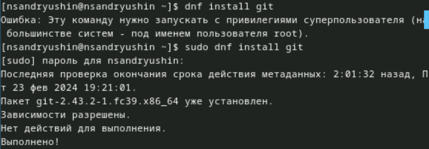{#fig:001}

Теперь установим gh (рис. [-@fig:002])

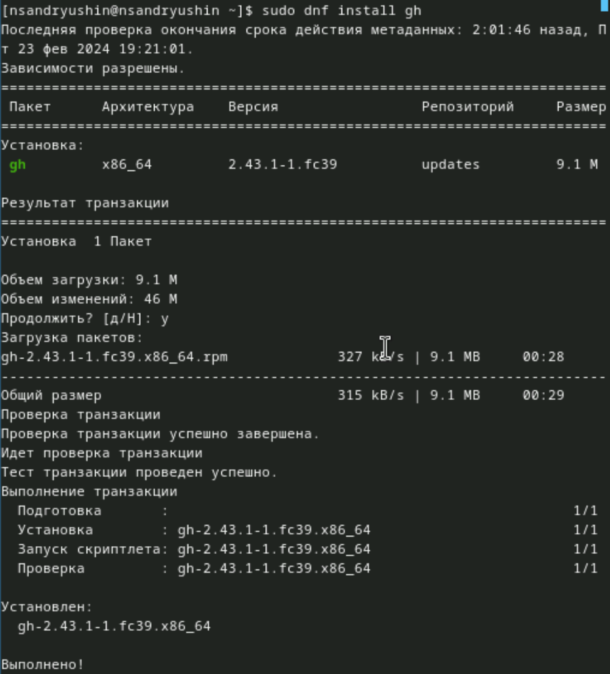{#fig:002 height=60%}

Далее, зададим имя для владельца репозитория. В данном случае это моё имя (рис. [-@fig:003])

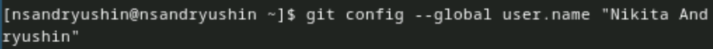{#fig:003}

Теперь зададим почту. Я задалa почту, на которую у меня зарегистрирован аккаунт на github (рис. [-@fig:004])

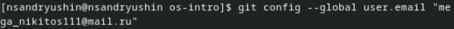{#fig:004}

Настроим кодировку utf8 в выводе сообщений git (рис. [-@fig:005])

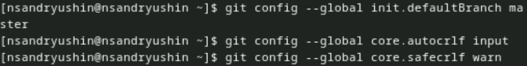{#fig:005}

Зададим имя начальной ветки, настроим параметры autocrlf и safecrlf (рис. [-@fig:006])

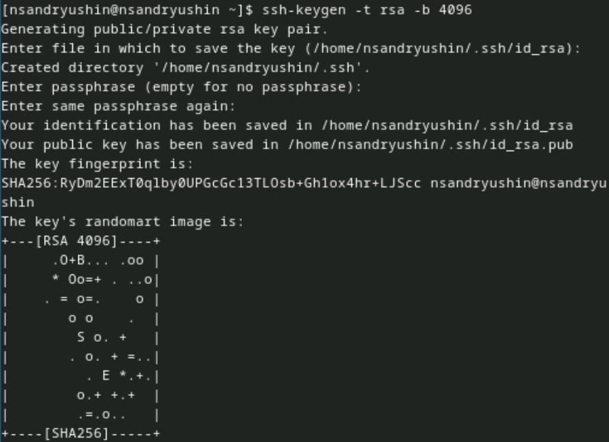{#fig:006}

Создадим ключ RSA размером 4096 бит (рис. [-@fig:007])

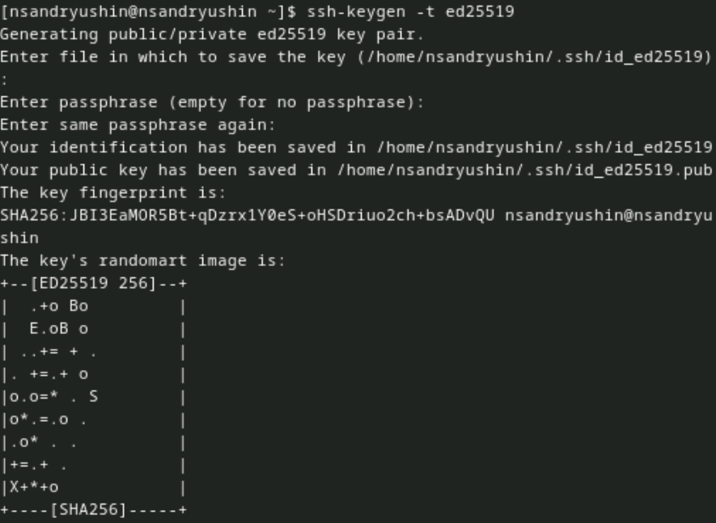{#fig:007 height=60%}

Теперь создадим ключ по алгоритму ed22519 (рис. [-@fig:008])

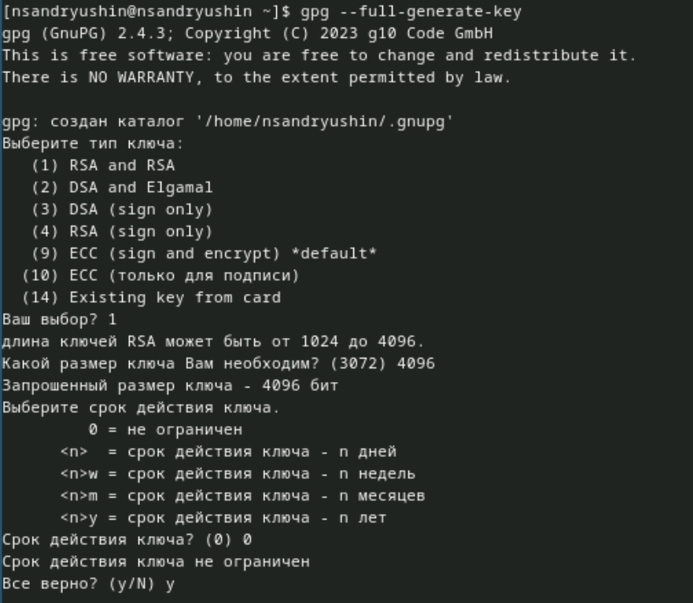{#fig:008 height=60%} 

Теперь создадим ключ gpg. Выбираем из предложенных вариантов первый тип (RSA and RSA), размер ключа задаём 4096 бит и делаем срок действия ключа неограниченным
После нас попросят ввести свои данные. Мы вводим имя и адрес электронной почты. После этого соглашаемся с генерацией ключа (рис. [-@fig:009])

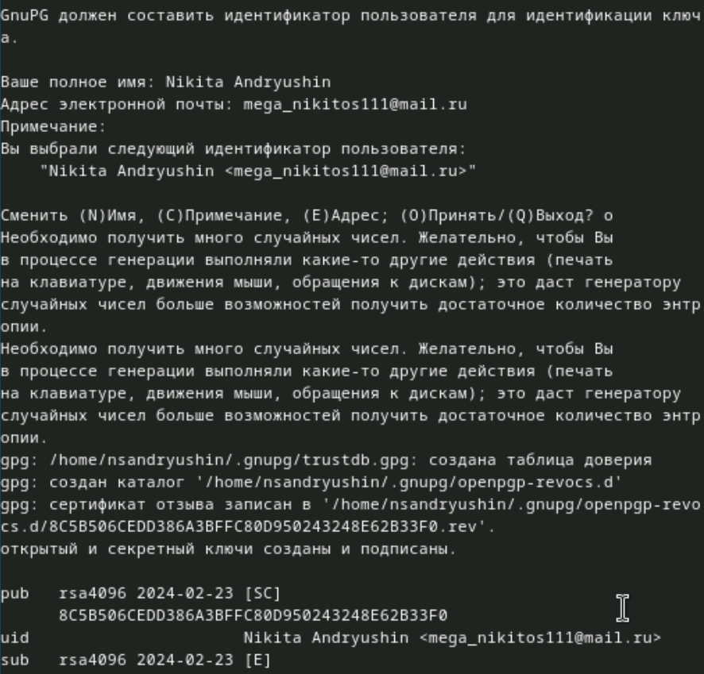{#fig:009 height=60%}

Далее, выводим список pgp ключей (рис. [-@fig:010])

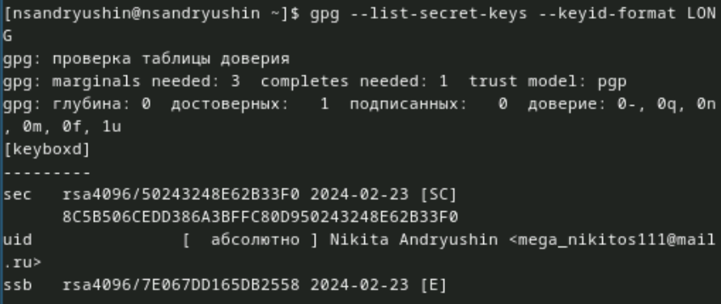{#fig:010 height=60%}

Копируем наш ключ в буфер обмена. Вставляем этот ключ на гитхаб, и задаём ему имя. Я выбралa имя Sway

Теперь производим настройку автоматических подписей (рис. [-@fig:011])

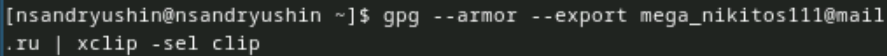{#fig:011}

Cоздаём рабочую директорию курса и переходим в неё. Далее, создаём репозиторий для лабораторных работ из шаблона и клонируем его к себе на компьютер. Переходим в него с помощью cd и удаляем ненужные файлы (package.json) и создаём необходимые каталоги, записав в файл COURSE строку os-intro (это наш текущий курс) и прописываем make prepare для того, чтобы нужные нам каталоги создались. Теперь добавляем нашу папку для отправки. Делаем коммит, в котором указываем, что мы сделали структуру курса. И отправляем файлы на сервер GitHub с помощью команды push.
# Выводы

Была произведена установка git, проведена его первоначальная настройка, были созданы ключи для авторизации и подписи, а также создан репозиторий курса из предложенного шаблона

# Ответы на контрольные вопросы

1. Системы контроля версий – это системы, в которых мы можем хранить свои проекты и выкладывать их обновления, контролируя релизы и каждые внесённые изменения. Эти системы нужны для работы над проектами, чтобы иметь возможность контролировать версии проектов и в случае командной работы контролировать изменения, внесённые всеми участниками. Также, VCS позволяют откатываться на более ранние версии
2. Хранилище – репозиторий, в нём хранятся все файлы проекта и все его версии  
commit – внесённые изменения в репозитории  
история – это история изменений файлов проекта  
рабочая копия – копия, сделанная из версии репозитория, с которой непосредственно работает сам разработчик
3. Централизованные системы контроля версий имеют один центральный репозиторий, с которым работают все разработчики. Примером является CVS, который является уже устаревшей системой.   
В децентрализованных системах же используется множество репозиториев одного проекта у каждого из разработчиков, при этом репозитории можно объединять брать из каждого только то, что нужно. Примером является знакомый нам Git
4. Создаётся репозиторий, и разрабатывается проект. При внесении изменений файлы отправляются на сервер
5. Разработчик клонирует репозиторий к себе на компьютер, и после внесения изменений выгружает их на сервер в качестве отдельной версии. После этого разработчики с более высокими правами могут, например, объединить его версию с текущей
6. Хранение файлов проекта, а также обеспечение командной работы, и контроль за версиями проекта
7. git clone – клонирует проект с сервера на компьютер  
git add – добавляет папку для выгрузки на сервер  
git commit – фиксирует изменения репозитория  
git push – выгружает изменения на сервер  
git pull – получить изменения с сервера  
git rm – удалить файл  
git status – получить статус репозитория
8. С локальным: git commit -am “added files” – создаёт коммит
С удалённым: git push – загрузить данные на удалённый сервер
9. Ветки – это несколько независимых копий проекта, в каждой из которых ведётся разработка какой-то конкретной функции, при этом ветки существуют параллельно. Они нужны, когда нужно параллельно вести разработку нескольких функций, а в конце их можно объединить в одну
10. Игнорировать файлы можно, внося их в файл .gitignore. Игнорировать файлы нужно, когда их не нужно добавлять в репозиторий. Например, это могут быть файлы виртуального окружения (venv)

