---
## Front matter
title: "Лабораторная работа №5"
subtitle: "Отчёт"
author: "Борисенкова София Павловна"

## Generic otions
lang: ru-RU
toc-title: "Содержание"

## Pdf output format
toc: true # Table of contents
toc-depth: 2
lof: true # List of figures
lot: true # List of tables
fontsize: 12pt
linestretch: 1.5
papersize: a4
documentclass: scrreprt

## I18n polyglossia
polyglossia-lang:
  name: russian
  options:
	- spelling=modern
	- babelshorthands=true
polyglossia-otherlangs:
  name: english
## I18n babel
babel-lang: russian
babel-otherlangs: english
## Fonts
mainfont: PT Serif
romanfont: PT Serif
sansfont: PT Sans
monofont: PT Mono
mainfontoptions: Ligatures=TeX
romanfontoptions: Ligatures=TeX
sansfontoptions: Ligatures=TeX,Scale=MatchLowercase
monofontoptions: Scale=MatchLowercase,Scale=0.9
## Biblatex
biblatex: true
biblio-style: "gost-numeric"
biblatexoptions:
  - parentracker=true
  - backend=biber
  - hyperref=auto
  - language=auto
  - autolang=other*
  - citestyle=gost-numeric
## Pandoc-crossref LaTeX customization
figureTitle: "Рис."
tableTitle: "Таблица"
listingTitle: "Листинг"
lofTitle: "Список иллюстраций"
lotTitle: "Список таблиц"
lolTitle: "Листинги"
## Misc options
indent: true
header-includes:
  - \usepackage{indentfirst}
  - \usepackage{float} # keep figures where there are in the text
  - \floatplacement{figure}{H} # keep figures where there are in the text
---

# Цель работы

Научиться пользоваться pass.

# Задание

Настроить ОС.  
Научиться использовать программы для управления паролями 

# Выполнение лабораторной работы

Для начала необходимо скачать pass и pass-opt (рис. [-@fig:001])

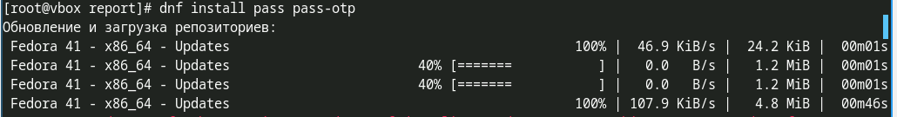{#fig:001}

Уставновим gopass (рис. [-@fig:002])

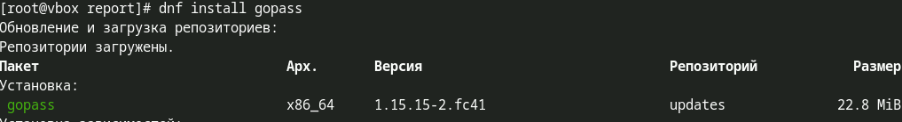{#fig:002}

Выведем список pgp ключей (рис. [-@fig:003])

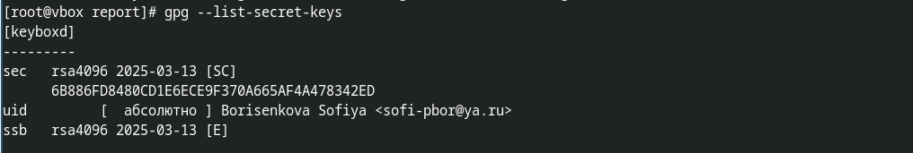{#fig:003}

Проинициализируем pass, указав свой email (рис. [-@fig:004])

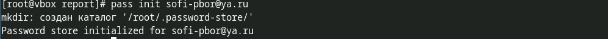{#fig:004}

Проинициализируем репозиторий в git для pass (рис. [-@fig:005])

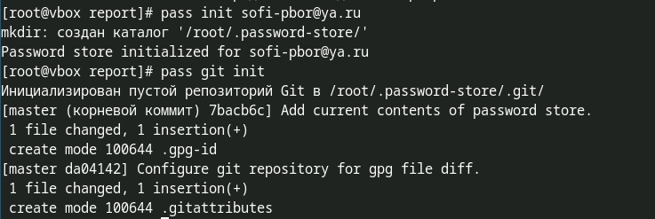{#fig:005}

Подключим репозиторий для скачивания browserpass. Установим browserpass (рис. [-@fig:006]
 
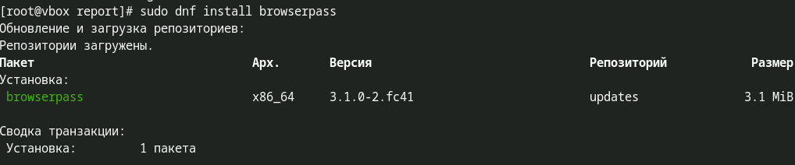{#fig:006}

Установим его в браузере
Создадим файл с паролем (рис. [-@fig:007])
 
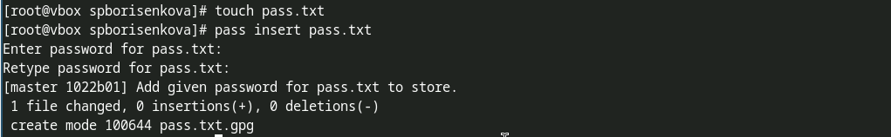{#fig:007}

И установим дополнительные пакеты (рис. [-@fig:008])
 
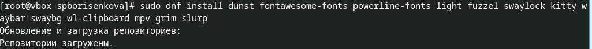{#fig:008}

Подключим репозиторий для скачивания шрифтов (рис. [-@fig:009])
 
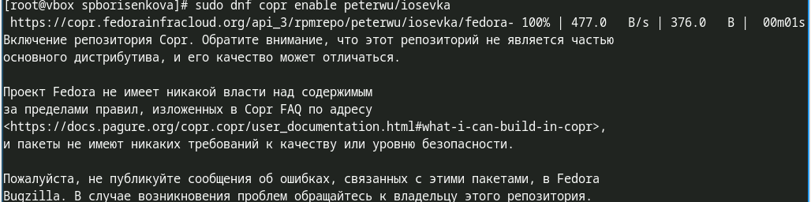{#fig:009}

Найдём шрифты (рис. [-@fig:010])
 
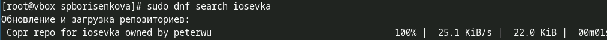{#fig:010}

И установим (рис. [-@fig:011])
 
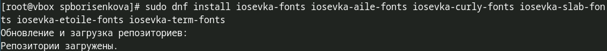{#fig:011}

# Выводы

В результате выполнения лабораторной работы были настроены программы для управления паролями.
